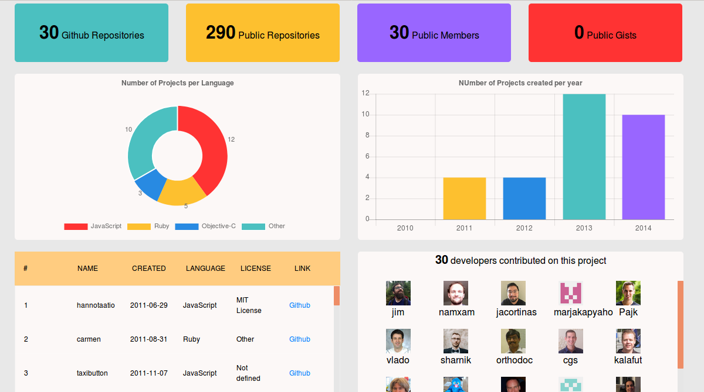

# vuejs-github-api

> A Vue.js  + Webpack App  .Demo : [futurice-github-api](https://vuejs-github-api.herokuapp.com/#/)<br> 

## Synopsis

- Build a web service that utilizes data provided by the Github API [version 3 (REST)](https://developer.github.com/v3/)
- Solution : Dashboard : Overview and latest statistics of Futurice github repositories and members .

 

## Libraries used
* VueJs
* Webpack
* Sass
* Vue-router
* Bootstrap 4
* Express 4
* Jest
* Heroku 7

## Getting started

``` bash

git clone git@github.com:asmab/vuejs-github-api.git

cd vuejs-github-api

npm install

npm run dev 

```
serve with hot reload : Open [http://localhost:8080](http://localhost:8080)<br>

# build for production with minification
```
npm run build
```

## Running the tests
```
npm run unit
```

## Deployment : deploy to Heroku

1- Create a Heroku app.
```
heroku create <vuejs-github-api>
```
2- Configure the project so that Heroku can serve up the vue code.
 Create server.js : [Express](https://expressjs.com/) script that Heroku can use to start a web server

```
npm run start
```

3- Push and deploy
 Add Heroku remote repository:
```
heroku git:remote --app <vuejs-github-api> && git add . && git commit -a -m "commit message" && git push heroku master
```
